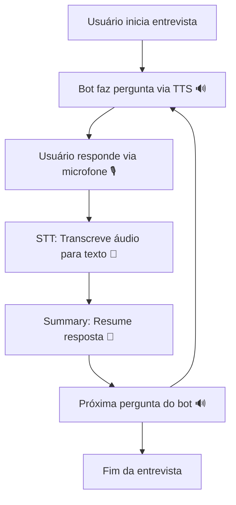

# 🎯 Zoom Sidekick MVP


## 🚀 Descrição do Projeto

O **Zoom Sidekick MVP** é uma solução de **entrevista automatizada com IA**, capaz de:

* 🎙️ Capturar áudio do usuário em tempo real
* 📝 Transcrever respostas (STT - Whisper)
* 🧠 Resumir respostas (GPT - OpenAI)
* 🔊 Gerar áudio da próxima pergunta (TTS - gTTS)
* 🤖 Conduzir entrevistas completas de forma automatizada

> MVP funcional, com **backend modular** e **frontend responsivo**, pronto para integração com Zoom ou Google Meet.


## 🗂 Estrutura do Projeto

```bash
zoom-sidekick-mvp/
├── backend/
│   ├── transcription.py                 # Processamento de áudio auxiliar
│   ├── app/
│   │   ├── main.py                      # Entry point FastAPI
│   │   ├── routes.py                    # Endpoints da API
│   │   ├── services/
│   │   │   ├── stt_service.py           # 🎙️ Áudio → Texto (Whisper)
│   │   │   ├── tts_service.py           # 🔊 Texto → Áudio (gTTS)
│   │   │   ├── summary_service.py       # 🧠 Resumo de respostas (GPT)
│   │   │   └── bot_service.py           # 🤖 Orquestra o fluxo da entrevista
│   │   └── utils/
│   │       ├── logger.py                # Logs estruturados
│   │       └── config.py                # Configurações globais da aplicação
│   ├── tests/
│   │   └── __init__.py                  # Inicializa o pacote de testes
│   ├── requirements.txt                 # Dependências do backend
│   └── Dockerfile                       # Configuração do container backend
├── frontend/
│   ├── index.html                        # Interface do usuário
│   ├── recorder.js                       # Captura áudio
│   └── style.css                         # Estilo moderno e responsivo
├── .env.example                          # Variáveis de ambiente de exemplo
├── .gitignore                            # Arquivos ignorados
├── docker-compose.yml                     # Orquestração de containers
└── README.md                              # Documentação
```

## ⚙️ Tecnologias Utilizadas

| Serviço     | Tecnologia              | Função                                  |
| ----------- | ----------------------- | --------------------------------------- |
| STT 🎙️      | Whisper (OpenAI)        | Transcrição de áudio                    |
| TTS 🔊      | gTTS                    | Conversão de texto em áudio             |
| Resumo 🧠   | OpenAI GPT              | Resumir respostas do candidato          |
| Backend 🖥️  | Python 3.11 + FastAPI   | API rápida e modular                    |
| Frontend 🌐 | HTML5, CSS3, JS         | Captura áudio e interação com o usuário |
| Deploy 🐳   | Docker & Docker Compose | Containerização                         |


## 📈 Fluxo da Entrevista



💡 Fluxo contínuo até todas as perguntas serem feitas.
Cada resposta é transcrita, resumida e o bot segue o próximo passo automaticamente.


## 🏃‍♂️ Como Rodar o Projeto

### 📥 Clone o repositório

```bash
git clone https://github.com/magali-leodato/zoom-sidekick-mvp.git
cd zoom-sidekick-mvp
```

### 📄 Variáveis de Ambiente

Copie o arquivo `.env.example` para `.env` e configure:

```bash
OPENAI_API_KEY=your_openai_api_key
```

### 🔧 Backend (FastAPI)

```bash
cd backend
python -m venv venv
source venv/bin/activate   # Linux / Mac
venv\Scripts\activate      # Windows

pip install -r requirements.txt
uvicorn app.main:app --reload
```

Backend disponível em: 👉 `http://localhost:8000`

### 🎨 Frontend

```bash
cd frontend
```

Abra `index.html` no navegador ou use a extensão **Live Server** no VSCode.

### 🐳 Docker (opcional)

```bash
docker-compose up --build
```

## 🧪 Testes

Para rodar os testes unitários:

```bash
pytest backend/tests/
```


## 📦 requirements.txt (backend)

Seu arquivo já está atualizado, mas certifique-se de conter pelo menos:

fastapi==0.99.0
uvicorn[standard]
openai
gtts
pytest
python-dotenv
```

Se estiver usando Whisper localmente, adicione:

```
whisper
```

E se estiver rodando em Docker, lembre-se de incluir também:

```
gunicorn
```

## 🔜 Próximos Passos

* 📹 Captura de áudio diretamente do Zoom / Google Meet

* 🎨 Melhorar UI/UX com feedback visual em tempo real

* 🔒 Adicionar autenticação e sessões de usuário

* 🗄️ Persistir respostas em banco de dados

* ✉️ Funções de follow-up (enviar e-mails, criar tarefas)


## 📹 Demonstração do MVP

[](https://youtu.be/SEU_VIDEO_ID)


## 👩‍💻 Desenvolvedor(a)

**Magali Leodato**

🔗 [LinkedIn](http://www.linkedin.com/in/magali-santos-leodato)
💻 [GitHub](http://github.com/magali-leodato)


## 📜 Licença

Este projeto está sob a licença MIT.
Veja o arquivo [LICENSE](LICENSE) para mais detalhes.

